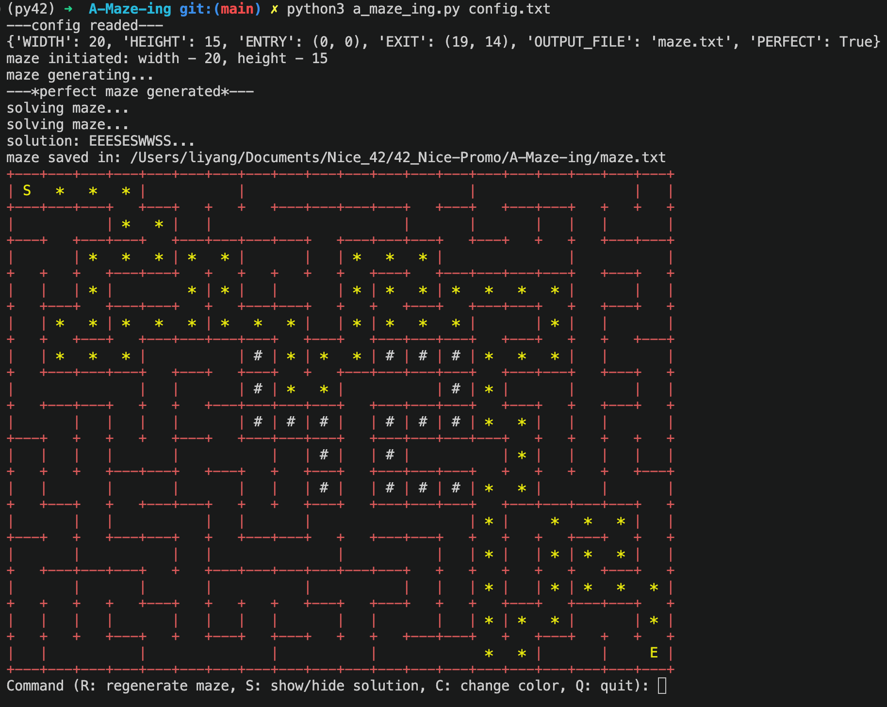

*This project has been created as part of the 42 curriculum by lyang, ylecain.*

# Description
**A-Maze-ing** is a maze generation and visualization project developed as part of the 42 curriculum.

The program generates a maze based on a configuration file, displays it in the terminal, calculates a solution path, and provides interactive controls to regenerate and visualize the maze.

The project also includes a reusable `mazegen` Python package containing the maze generation logic.

<!--  -->

<!-- ## Features
- Random maze generation
- Perfect and non-perfect maze generation
- Configurable maze size
- Configurable entry and exit points
- Optional seed for reproducible maze generation
- Maze solution generation
- Terminal-based visualization
- `42` pattern displayed in the maze
- Interactive controls:
  - `R` — regenerate the maze
  - `S` — show / hide the solution
  - `C` — change wall color
  - `Q` — quit
- Maze exported to an output file
- Reusable `mazegen` Python package -->

### Project Structure
```
A-Maze-ing/
├── Makefile
├── README.md
├── config.txt
├── a_maze_ing.py
├── maze_renderer.py
├── mazegen/
│   ├── __init__.py
│   └── generator.py
└── image.png
```
The project is divided into two main parts:

#### Maze Generator
```
mazegen/
```
Contains the reusable maze generation and solving logic.

#### Visualization
```
maze_renderer.py
```
Handles terminal visualization and user interaction.

This separation keeps the maze generation logic independent from the visualization layer and makes the generator easier to reuse.

# Instructions
### Requirements

- Python 3.10+
- `make`

The project does not require additional external libraries to run the main program.

### Run with Makefile

From the project root:

```bash
make run
```
### Run directly
From the project root:

```bash
python3 a_maze_ing.py config.txt
```

### Available Makefile Commands

Command	Description
make install	Install development tools
make run	Run the maze generator
make debug	Run the program with Python's debugger
make clean	Remove generated Python cache files
make lint	Run flake8 and mypy
make lint-strict	Run strict mypy checks

### Interactive Visualization
Once the maze is displayed, the following commands are available:

Key	Action
R	Regenerate the maze
S	Show / hide the solution
C	Change the wall color
Q	Quit

The maze and its solution can therefore be explored interactively without restarting the program.


# Resources
This program is made by VS Code, Chatgpt and google helped us when we have understanding questions.

# Configuration
The program uses a configuration file named config.txt.

### Mandatory Keys

```
WIDTH=20
HEIGHT=15
ENTRY=0,0
EXIT=19,14
OUTPUT_FILE=maze.txt
PERFECT=True
```

### Optional Keys

```
SEED=42
```

# Algorithm
The maze generator uses Depth-First Search (DFS) with backtracking.

The algorithm starts from the entry cell and explores unvisited neighboring cells. When moving to a new cell, the wall between the two cells is removed.

When the current cell has no unvisited neighbors, the algorithm backtracks to a previous cell and continues the exploration.

This process continues until all cells have been visited.

### Perfect Maze
When:
```
PERFECT=True
```
the generated maze is a perfect maze.

The DFS backtracking algorithm creates a spanning tree of the maze. As a result:

Every cell is reachable.
There are no cycles.
There is exactly one path between any two cells.

Therefore, there is exactly one solution between the entry and exit.

### Non-Perfect Maze

When:
```
PERFECT=False
```
the program first generates a perfect maze and then randomly removes additional internal walls.

This introduces loops and creates multiple possible paths through the maze.

# Reusable code
The maze generation logic is separated from the visualization code and packaged as a reusable Python library.

The package is distributed as:
```
mazegen-1.0.0-py3-none-any.whl
```
This allows the maze generator to be reused independently from the main visualization program.

### Installation

Install the wheel package with:
```bash
pip install mazegen-1.0.0-py3-none-any.whl
```

### Example
```python
from mazegen import MazeGenerator

generator = MazeGenerator(20, 20, (0,0), (19,19))

maze = generator.generate_maze()
solution = generator.solve()

generator.output_maze()
```
The generated maze and its solution can then be used by another application or visualization system.

# Team
*lyang*: Project planning and scheduling. Code and documentation. \
*ylecain*: Project understanding. Code and documentation.

### Planning
We worked separately from home while keeping in touch through Slack and collaborating through GitHub.

**1st week**: read project subject and start write some funstions, trying to realize maze generator. \
**2nd week**: realize maze generator and visulization, finish ducomentation. Evaluation.

### Evaluation
We used maze_analyzer.py to verify that generated mazes satisfy the required constraints.

We also manually checked the generated mazes through the terminal visualization and tested the interactive features.

<!-- ### well done
We realized maze generation and interactable visulization with out invite extra liborary. Our program is esay to read and reuse. The reusable part of code are avaliable for any other program and easy to imply. -->

### Future Work
Possible improvements include:
- More interactive visualization features.
- Dynamic solution generation.
- Additional maze generation algorithms.
- More visualization modes.
- More configurable maze patterns and themes.
